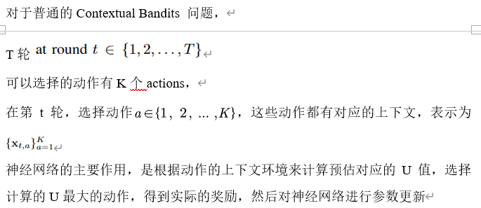
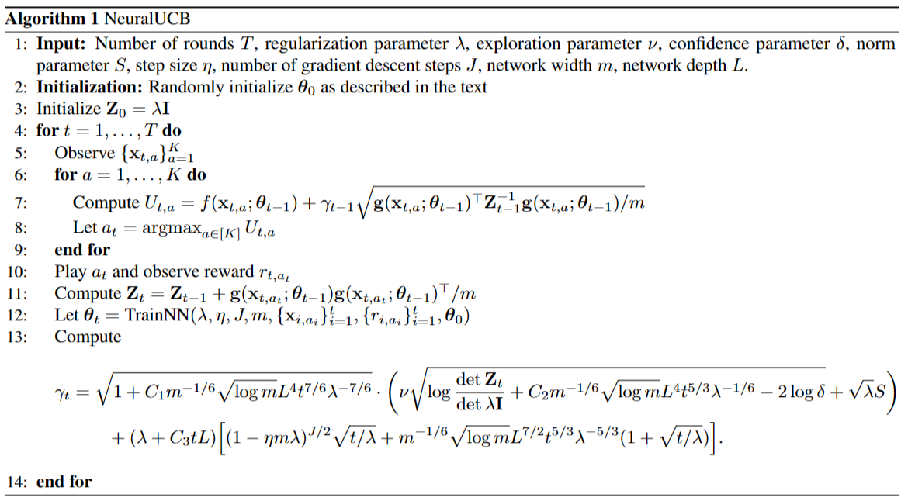

# NeuralUCB
This repository contains our pytorch implementation of NeuralUCB in the paper [Neural Contextual Bandits with UCB-based Exploration](https://arxiv.org/pdf/1911.04462.pdf) (accepted by ICML 2020). 

## Prerequisites: 
* Pytorch and CUDA
* future==0.18.2
* joblib==0.15.1
* numpy==1.18.1
* pkg-resources==0.0.0
* scikit-learn==0.22.1
* scipy==1.4.1
* torch==1.5.0

## Usage:
Use python to run train.py for experiments.

## Command Line Arguments:
* --size: bandit algorithm time horizon
* --dataset: datasets
* --shuffle: to shuffle the dataset or not
* --seed: random seed for shuffle
* --nu: nu for control variance
* --lambda: lambda for regularization
* --hidden: network hidden size


## Usage Examples:
* Run experiments on [mnist](http://yann.lecun.com/exdb/publis/pdf/lecun-98.pdf):
```bash
  -  python3 train.py --nu 0.00001 --lamdba 0.00001 --dataset mnist
```

## 实现原理概述



## 代码解读
train.py

1、args输入的参数：
Bandit的数量 --size', default=15000, type=int, help='bandit size')
使用什么数据集 --dataset', default='mnist', metavar='DATASET')
数据集是否打乱 --shuffle', type=bool, default=1, metavar='1 / 0', help='shuffle the data set or not')
随机数的种子 --seed', type=int, default=0, help='random seed for shuffle, 0 for None')
？控制变量的系数 --nu', type=float, default=1, metavar='v', help='nu for control variance')  #
？正则化的系数 --lamdba', type=float, default=0.001, metavar='l', help='lambda for regularzation')  # 正则化系数
upn隐藏层的数目 --hidden', type=int, default=100, help='network hidden size')  # upn的隐藏层数目

2、引入了b = Bandit_multi
Bandit_multi定义在data_multi.py中
X: 输入
y：输出
y_arm: 根据y生成的独热码
cursor：记录当前处理到的样本
size：记录当前的数据集的大小
n_arm：数据集中臂的个数，此处是10
dim: 输入数据集的像素数*标签的个数（输入维度*输出的维度）
act_dim: 每个臂的特征向量的维度，此处是数据集的像素数

def step:
用来初始化特征向量和奖励

def finish
判断是否处理完整个数据集

reset(self)
将光标重置为0，以重新开始处理数据集

3、引入l = NeuralUCBDiag
self.func # 创建神经网络
self.context_list = [] # 上下文列表
self.reward = [] # 奖励列表
self.lamdba = lamdba # 正则化系数
self.total_param  # 网络参数的数量
self.U = lamdba * torch.ones((self.total_param,)).cuda() # U矩阵
self.nu

def select 返回选择的臂，梯度的范数，平均标准差和平均奖励

环境变量：cpu和gpu的占用，响应时间
动作：选择退出点和处理单元

